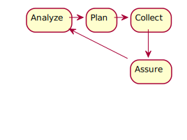
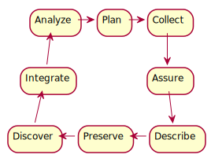

class: inverse, center, middle, animated, fadeIn

```{r setup, include=FALSE}
options(htmltools.dir.version = FALSE)
library(plantuml)
library(tools)
library(dplyr)
library(magrittr)
library(knitr)
library(kableExtra)
library(DT)
library(qrcode)
library(widgetframe)
##
library(emeScheme)
```

```{css, echo=FALSE}
/* custom.css */

.left-code {
  color: #777;
  width: 38%;
  height: 92%;
  float: left;
}
.right-plot {
  width: 60%;
  float: right;
  padding-left: 1%;
}
.plot-callout {
  height: 225px;
  width: 450px;
  bottom: 5%;
  right: 5%;
  position: absolute;
  padding: 0px;
  z-index: 100;
}
.plot-callout img {
  width: 100%;
  border: 4px solid #23373B;
}
.middle-text {
  color: #777;
  width: 30%;
  height: 100%;
  float: middle;
}
.left-text {
  color: #777;
  width: 30%;
  height: 100%;
  float: left;
}
.right-text {
  color: #777;
  width: 30%;
  height: 100%;
  float: right;
}

.scroll {
  background: #FFBB33;
  width: 100%;
  height: 80%;
  overflow-x: scroll;
  overflow-y: scroll;
  padding-right: 1px;
  padding-bottom: 1px;
}

.dt {
  font-size: 11px;
}

```


```{r data_life_cycle_1, message=FALSE, warning=FALSE, cache= TRUE, include=FALSE}
fn <- file.path("figs", paste0(print(opts_current$get("label")), ".svg"))
'

Plan -right-> Collect
-down-> Assure
-down-> Describe
-left-> Preserve
-left-> Discover
-up-> Integrate
-up-> Analyze

Analyze -right-> Plan

Assure --> Analyze

hide Describe
hide Preserve
hide Discover
hide Integrate
' %>%
  plantuml %>%
  plot(file = fn)
```

```{r data_life_cycle_2, message=FALSE, warning=FALSE, cache = TRUE, include=FALSE}
fn <- file.path("figs", paste0(print(opts_current$get("label")), ".svg"))
'
Plan -right-> Collect
-down-> Assure
-down-> Describe
-left-> Preserve
-left-> Discover
-up-> Integrate
-up-> Analyze

Analyze -right-> Plan

Assure -[hidden]-> Analyze

' %>%
  plantuml %>%
  plot(file = fn)
```


```{r data_layout_6,message=FALSE, warning=FALSE, cache = TRUE, include = FALSE}
fn <- file.path("figs", paste0(print(opts_current$get("label")), ".svg"))
dl <- '
!define Project(name,desc) class name as "desc" << (P,red) >> #TECHNOLOGY
!define Data(name,desc) class name as "desc" << (D,crimson) >> #TECHNOLOGY
!define MetaData(name,desc) class name as "desc" << (M,lime) >>

Project(Project, Project) {
  {field} Project description
  {method} - dataCite metadata
}

MetaData(Experiment_1, Experiment_1) {
  {field} Experimental description
  {method} + Experiment
}

MetaData(Experiment_n, Experiment_n) {
  {field} Experimental description
  {method} + Experiment
}

MetaData(Experiment_2, Experiment_2) {
  {field} Experimental description
  {method} + Experiment
}

MetaData(Treatment_1, Treatment_1) {
  {field} Treatment Description
  {method} + Treatment
}

MetaData(Treatment_n, Treatment_n) {
  {field} Treatment Description
  {method} + Treatment
}

MetaData(Treatment_2, Treatment_2) {
  {field} Treatment Description
  {method} + Treatment
}

MetaData(Sampling, Sampling) {
  {field} Sampling of Microcosms
  {method} + Sampling
}

MetaData(Measurement_1, Measurement_1) {
  {field} Measurement description
  {method} + Measuring
}


MetaData(Measurement_n, Measurement_n) {
  {field} Measurement description
  {method} + Measuring
}

MetaData(Measurement_2, Measurement_2) {
  {field} Measurement description
  {method} + Measuring

}
Data( RawData, RawData) {
  {field} Measured Raw Data
  {method} - dataCite metadata
  {method} - emeScheme metadata
}

MetaData( DataExtraction_1, DataExtraction_1) {
  {field} Extraction Method
  {method} + DataExtraction
}

MetaData( DataExtraction_n, DataExtraction_n) {
  {field} Extraction Method
  {method} + DataExtraction
}

MetaData( DataExtraction_2, DataExtraction_2) {
  {field} Extraction Method
  {method} + DataExtraction
}

Data( ExtractedData, ExtractedData_1) {
  {field} Extracted Data
  {method} - dataCite metadata
  {method} - emeScheme metadata

}


Project "1" *-- "many" Experiment_1 : contains
Project "1" *-- "many" Experiment_2 : contains
Project "1" *-- "many" Experiment_n : contains

Experiment_n "1" *-- "many" Treatment_1 : contains
Experiment_n "1" *-- "many" Treatment_2 : contains
Experiment_n "1" *-- "many" Treatment_n : contains

Treatment_n "1" *-- "1" Sampling : contains

Sampling "1" *-- "many" Measurement_1 : contains
Sampling "1" *-- "many" Measurement_2 : contains
Sampling "1" *-- "many" Measurement_n : contains

Measurement_n "1" *-- "1" RawData : contains

RawData "1" *-- "many" DataExtraction_1 : contains
RawData "1" *-- "many" DataExtraction_2 : contains
RawData "1" *-- "many" DataExtraction_n : contains

DataExtraction_n "1" *-- "1" ExtractedData : contains
'
dl %>%
  plantuml %>%
  plot(fn)
```

```{r data_layout_5,message=FALSE, warning=FALSE, cache = TRUE, include = FALSE}
fn <- file.path("figs", paste0(print(opts_current$get("label")), ".svg"))
dl <- paste0(
  dl, 
  '
hide DataExtraction_1
hide DataExtraction_n
hide DataExtraction_2
'
)

dl %>%
  plantuml %>%
  plot(fn)
```

```{r data_layout_4, message=FALSE, warning=FALSE, cache = TRUE, include = FALSE}
fn <- file.path("figs", paste0(print(opts_current$get("label")), ".svg"))
dl <- paste0(
  dl, 
  '
hide Measurement_1
hide Measurement_n
hide Measurement_2
'
)

dl %>%
  plantuml %>%
  plot(fn)
```

```{r data_layout_3, message=FALSE, warning=FALSE, cache = TRUE, include = FALSE}
fn <- file.path("figs", paste0(print(opts_current$get("label")), ".svg"))
dl <- paste0(
  dl, 
  '
hide Sampling
'
)

dl %>%
  plantuml %>%
  plot(fn)
```

```{r data_layout_2, message=FALSE, warning=FALSE, cache = TRUE, include = FALSE}
fn <- file.path("figs", paste0(print(opts_current$get("label")), ".svg"))
dl <- paste0(
  dl, 
  '
hide Treatment_1
hide Treatment_n
hide Treatment_2

'
)

dl %>%
  plantuml %>%
  plot(fn)
```

```{r data_layout_1, message=FALSE, warning=FALSE, cache = TRUE, include = FALSE}
fn <- file.path("figs", paste0(print(opts_current$get("label")), ".svg"))
dl <- paste0(
  dl, 
  '
hide Experiment_1
hide Experiment_n
hide Experiment_2
'
)

dl %>%
  plantuml %>%
  plot(fn)
```

```{r data_layout, message=FALSE, warning=FALSE, cache = TRUE, include = FALSE}
fn <- file.path("figs", paste0(print(opts_current$get("label")), ".svg"))
dl <- paste0(
  dl, 
  '
hide Experiment_1
hide Experiment_n
hide Experiment_2
hide Treatment_1
hide Treatment_n
hide Treatment_2
hide Sampling
hide Measurement_1
hide Measurement_n
hide Measurement_2
hide DataExtraction_1
hide DataExtraction_n
hide DataExtraction_2
'
)

dl %>%
  plantuml %>%
  plot(fn)
```

# What is the emeScheme?

---
class: left, top, animated, fadeIn

## What is it?

- metadata **Scheme**
- for **E**cological **M**icrocosm **E**xperiments

--
<html><div style='float:left'></div><hr color='#EB811B' size=1px width=796px></html>

## What does this metada scheme do?

- standardised structure
- standardised terminology / property names
- to describe the an Ecological Microcosm Experiment

--
<html><div style='float:left'></div><hr color='#EB811B' size=1px width=796px></html>

## What is the metadata?

- Materials
- Conditions / Manipulations
- Measuring
- Data conversions


---
class: inverse, center, middle, animated, fadeIn

# Why do we need it?

---
class: animated, fadeIn
## Data Life Cylce
.center[

]
Adapted from https://www.dataone.org/data-life-cycle

???
- **Plan**: description of the data that will becompiled, and how the data will be managed and made accessible throughout its lifetime

- **Collect**: observations are made either by hand  or with sensors or other instruments  and the data are placed a into digital form

- **Assure**: the quality of the data are assured through checks and inspections

- **Analyze**: data are analyzed

<html><div style='float:left'></div><hr color='#EB811B' size=1px width=796px></html>

- **Preserve**: data are submitted to an appropriate long-term archive (i.e. data center)

- **Discover**: potentially useful data are located and obtained, along with the relevant information about the data 

- **Integrate**: data from disparate sources are combined to form one homogeneous set of data that can be readily analyzed

- **Describe**: data are accurately and thoroughly described using the appropriate metadata standards

(metadata)

---
class: animated, fadeIn

## Data Life Cylce

.center[

]

Adapted from https://www.dataone.org/data-life-cycle

???
- **Plan**: description of the data that will becompiled, and how the data will be managed and made accessible throughout its lifetime

- **Collect**: observations are made either by hand  or with sensors or other instruments  and the data are placed a into digital form

- **Assure**: the quality of the data are assured through checks and inspections

- **Describe**: data are accurately and thoroughly described using the appropriate metadata standards

- **Preserve**: data are submitted to an appropriate long-term archive (i.e. data center)

- **Discover**: potentially useful data are located and obtained, along with the relevant information about the data (metadata)

- **Integrate**: data from disparate sources are combined to form one homogeneous set of data that can be readily analyzed

- **Analyze**: data are analyzed
---
class: left, top, animated, fadeIn

## Why do we want this?

- Data should be archived

- Data should be findable

- Data is Re-usable

- We can re-use other data

--

- Data should not disappear

--

<html><div style='float:left'></div><hr color='#EB811B' size=1px width=796px></html>

- Data should be FAIR


---
class: animated, fadeIn 

## What is FAIR?
- **F**indable
- **A**ccessible
- **I**nteroperable
- **R**e-usable

See [https://www.force11.org/group/fairgroup/fairprinciples](https://www.force11.org/group/fairgroup/fairprinciples) for a detailed description.

???
- To be Findable:

  - F1. (meta)data are assigned a globally unique and eternally persistent identifier.
  - F2. data are described with rich metadata.
  - F3. (meta)data are registered or indexed in a searchable resource.
  - F4. metadata specify the data identifier.

- TO BE ACCESSIBLE:

  - A1  (meta)data are retrievable by their identifier using a standardized communications protocol.
  - A1.1 the protocol is open, free, and universally implementable.
  - A1.2 the protocol allows for an authentication and authorization procedure, where necessary.
  - A2 metadata are accessible, even when the data are no longer available.

- TO BE INTEROPERABLE:

  - I1. (meta)data use a formal, accessible, shared, and broadly applicable language for knowledge representation.
  - I2. (meta)data use vocabularies that follow FAIR principles.
  - I3. (meta)data include qualified references to other (meta)data.

- TO BE RE-USABLE:

  - R1. meta(data) have a plurality of accurate and relevant attributes.
  - R1.1. (meta)data are released with a clear and accessible data usage license.
  - R1.2. (meta)data are associated with their provenance.
  - R1.3. (meta)data meet domain-relevant community standards.
---
class: inverse, center, middle, animated, fadeIn

# We need the emeScheme!


---
class: animated, fadeIn
background-image: url(figs/data_layout_1.svg)
background-position: center
background-size: contain

--

.left-text[
## Data Levels

- Raw Data
  - videos
  - images
  - count data from manual count

- Extracted data
  - bemovi
  - extracted size distributions
  - extracted count / density data
]
---
class: animated, fadeIn
background-image: url(figs/data_layout_2.svg)
background-position: center
background-size: contain

.right-text[
## Metadata levels

- Experiment
]

---
class: animated, fadeIn
background-image: url(figs/data_layout_3.svg)
background-position: center
background-size: contain

.right-text[
## Metadata levels

- Experiment

- Treatment
]

---
class: animated, fadeIn
background-image: url(figs/data_layout_4.svg)
background-position: center
background-size: contain

.right-text[
## Metadata levels

- Experiment

- Treatment

- Sampling 
]

---
class: animated, fadeIn
background-image: url(figs/data_layout_5.svg)
background-position: center
background-size: contain

.right-text[
## Metadata levels

- Experiment

- Treatment

- Sampling 

- Measurement <span>&#8658;</span> **Raw Data**
]

---
class: animated, fadeIn
background-image: url(figs/data_layout_6.svg)
background-position: center
background-size: contain

.right-text[
## Metadata levels

- Experiment

- Treatment

- Sampling 

- Measurement <span>&#8658;</span> **Raw Data**

- Data DataExtraction <span>&#8658;</span> **Extracted Data**
]

---
class: animated, fadeIn
background-image: url(figs/data_layout_6.svg)
background-position: center
background-size: contain

.left-text[
## Data Levels

- Raw Data
  - videos
  - images
  - count data from manual count

- Extracted data
  - bemovi
  - extracted size distributions
  - extracted count / density data
]

.right-text[
## Metadata levels

- Experiment

- Treatment

- Sampling 

- Measurement <span>&#8658;</span> **Raw Data**

- Data DataExtraction <span>&#8658;</span> **Extracted Data**
]

---
class: animated, fadeIn

.dt[
```{r echo=FALSE}
x <- emeScheme_gd %>%
  select(Property_Level_1)
  
x[is.na(x)] <- ""
x %<>% 
  apply(1, paste, collapse = " ") %>%
  trimws() %>%
  sapply(
    function(i) {
      i != ""
      # 1 %in% unlist(gregexpr("[A-Z]", i))
    }
  )
##

emeScheme_gd %>%
  select(Property_Level_1) %>%
  filter(x) %>%
  datatable(
    options = list(
      pageLength = 18,
      dom = "tip",
      ordering = FALSE
    ),
    class = 'cell-border stripe', 
    height = 600,
    style = "default"
  )
```
]

---
class: animated, fadeIn

.dt[
```{r echo=FALSE}
x <- emeScheme_gd %>%
  select(Property_Level_1, Property_Level_2)
  
x[is.na(x)] <- ""
x %<>% 
  apply(1, paste, collapse = " ") %>%
  trimws() %>%
  sapply(
    function(i) {
      i != ""
      # 1 %in% unlist(gregexpr("[A-Z]", i))
    }
  )
##

emeScheme_gd %>%
  select(Property_Level_1, Property_Level_2) %>%
  filter(x) %>%
  datatable(
    options = list(
      pageLength = 18,
      dom = "tip",
      ordering = FALSE
    ),
    class = 'cell-border stripe', 
    height = 600,
    style = "default"
  )
```
]

---
class: animated, fadeIn

.dt[
```{r echo=FALSE}
x <- emeScheme_gd %>%
  select(Property_Level_1, Property_Level_2, Property_Level_3)
x[is.na(x)] <- ""
x %<>% 
  apply(1, paste, collapse = " ") %>%
  trimws() %>%
  sapply(
    function(i) {
      i != ""
      # 1 %in% unlist(gregexpr("[A-Z]", i))
    }
  )
##

emeScheme_gd %>%
  filter(x) %>%
  select(Property_Level_1, Property_Level_2, Property_Level_3) %>%
  datatable(
    options = list(
      pageLength = 18,
      dom = "tip",
      ordering = FALSE
    ),
    class = 'cell-border stripe', 
    height = 600,
    style = "default"
  )
```
]

---
class: animated, fadeIn

.dt[
```{r echo=FALSE}
x <- emeScheme_gd %>%
  select(Property_Level_1, Property_Level_2, Property_Level_3, Property_Level_4)
x[is.na(x)] <- ""
x %<>% 
  apply(1, paste, collapse = " ") %>%
  trimws() %>%
  sapply(
    function(i) {
      i != ""
      # 1 %in% unlist(gregexpr("[A-Z]", i))
    }
  )
##

emeScheme_gd %>%
  filter(x) %>%
  select(Property_Level_1, Property_Level_2, Property_Level_3, Property_Level_4) %>%
  datatable(
    options = list(
      pageLength = 18,
      dom = "tip",
      ordering = FALSE
    ),
    class = 'cell-border stripe', 
    height = 600,
    style = "default"
  ) %>%
widgetframe::frameableWidget()
```
]

---
class: animated, fadeIn
background-image: url("`r knitr::fig_chunk("data_layout_6", "png")`")
background-position: center
background-size: contain

.left-text[
## Data Levels

- Raw Data
  - videos
  - images
  - count data from manual count

- Extracted data
  - bemovi
  - extracted size distributions
  - extracted count / density data
]

.right-text[
## Metadata levels

- Experiment

- Treatment

- Sampling 

- Measurement <span>&#8658;</span> **Raw Data**

- Data DataExtraction <span>&#8658;</span> **Extracted Data**
]

---
class: animated, fadeIn, center, middle

**Website** of the **emeScheme**: 

[https://exp-micro-ecol-hub.github.io/emeScheme/](https://exp-micro-ecol-hub.github.io/emeScheme/)

```{r qr_emeShemeSite, fig.height=2, fig.width=2, echo = FALSE}
qrcode::qrcode_gen('https://exp-micro-ecol-hub.github.io/emeScheme/')
```


**Presentation** at: 

[https://rkrug.github.io/emeScheme_Introduction/The_emeScheme.html](https://rkrug.github.io/emeScheme_Introduction/The_emeScheme.html)

```{r qr_presentation, fig.height=2, fig.width=2, echo = FALSE}
qrcode::qrcode_gen('https://rkrug.github.io/emeScheme_Introduction/The_emeScheme.html')
```


